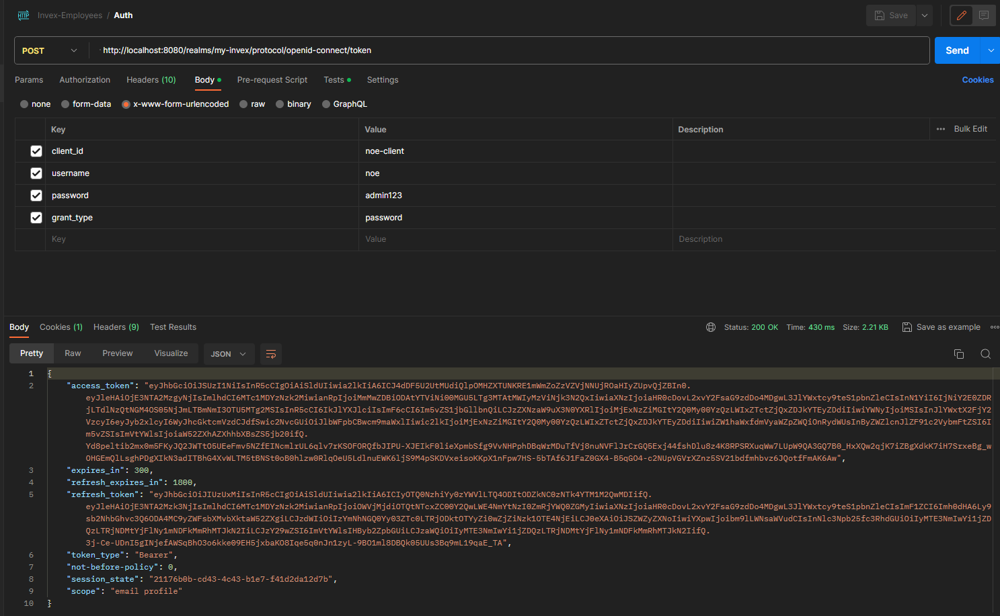
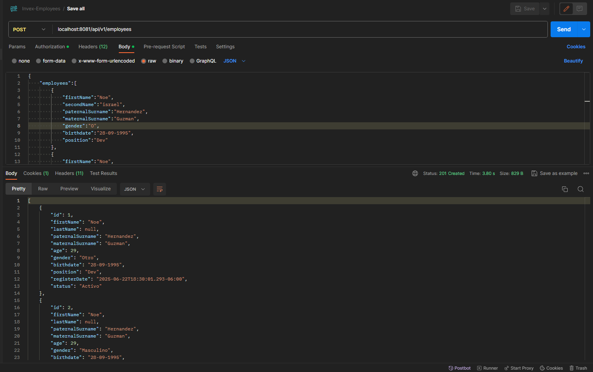
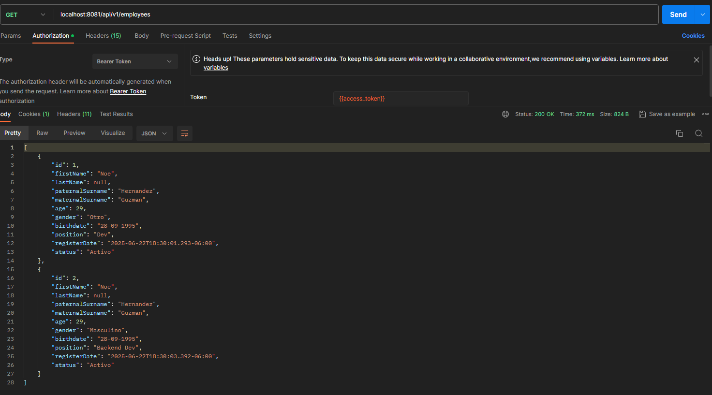
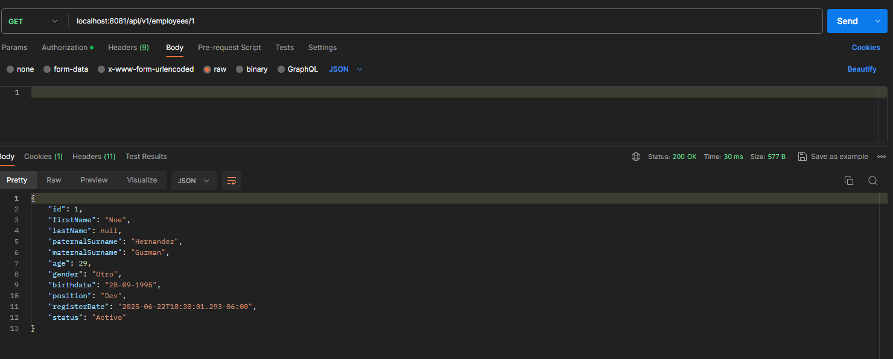

# Aplicación con Oracle, Keycloak y Spring Boot usando Docker Compose

Este proyecto levanta un entorno completo para una aplicación basada en Spring Boot que utiliza Keycloak para autenticación y Oracle como base de datos, todo orquestado con `docker-compose`.

## Contenido del proyecto

- **Oracle Database**: Base de datos relacional utilizada por la aplicación Spring Boot.
- **Keycloak**: Servidor de identidad y acceso que maneja la autenticación y autorización.
- **Aplicación Spring Boot**: Aplicación principal que se conecta a Oracle y utiliza Keycloak para la seguridad.

## Requisitos previos

- Docker
- Docker Compose

> Asegúrate de que los puertos necesarios ( 8080, 1521, 8081) estén libres en tu máquina local.

## Servicios

### 1. Oracle Database
- Imagen utilizada: `gvenzl/oracle-free` 
- Puerto expuesto: `1521`
- Usuario y contraseña configurados mediante variables de entorno en `docker-compose.yml`. 
- usuario: INVEX password:Invex123

### 2. Keycloak
- Imagen: `quay.io/keycloak/keycloak:24.0.3`
- Puerto expuesto: `8081`
- Realm, clientes y usuarios importados desde `keycloak/realm-export.json`.

### 3. Aplicación Spring Boot
- Construida desde el `Dockerfile` en la carpeta `app/`.
- Puerto expuesto: `8080`
- Se conecta a Oracle y utiliza Keycloak como proveedor de identidad (OIDC).

## Cómo levantar la aplicación

1. **Clonar el repositorio**
```bash
git https://github.com/NHernandezH/invex-test.git
cd invex-test
```

Una vez en la raiz del proyecto levanta los contenedores
```bash
docker-compose up --build
```

## Cómo probar la aplicacion

Dentro del directorio del proyecto viene una colleccion postman que te permite ejecutar las peticiones al api y generar el token de utorizacion

> Invex-Employees.postman_collection

como primer paso ejecuta el api de autenticacion



el token se almacena en la variable {{access_token}}, posteriormente puede ejecutar las demas apis y en automatico enviara tomara el token generado

API para guardar uno o mas empleados


API para consultar todos los empleados


API para consultar empleados por id


